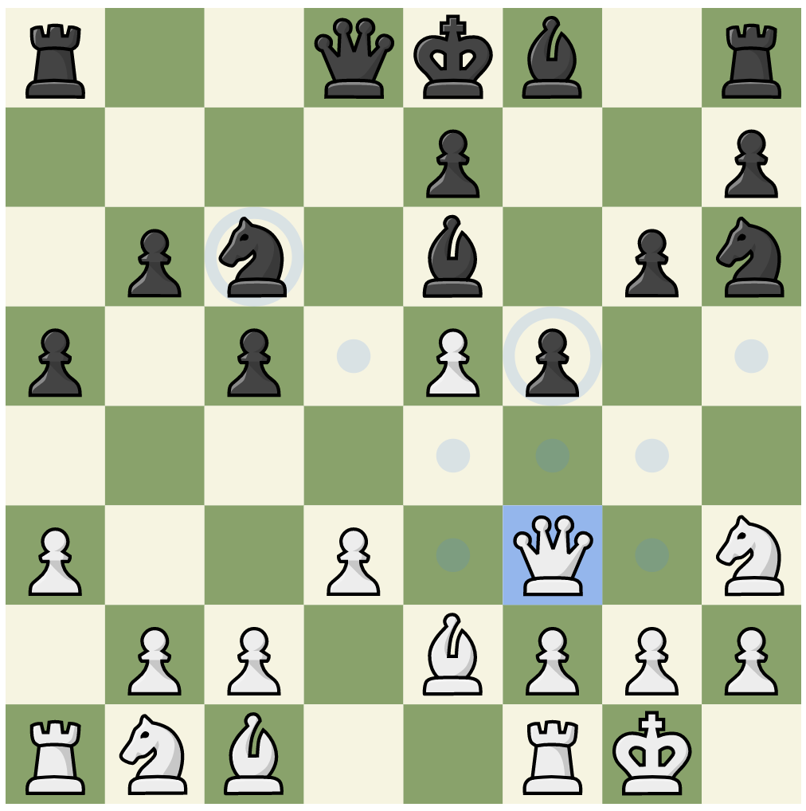

# Chess Practice UI
This is a test project intended to eventually be used as the UI for an app to practice chess openings and perhaps other chess things.  It's currently capable of allowing pieces to move around, knowing what moves are legal, and parsing of FEN codes

